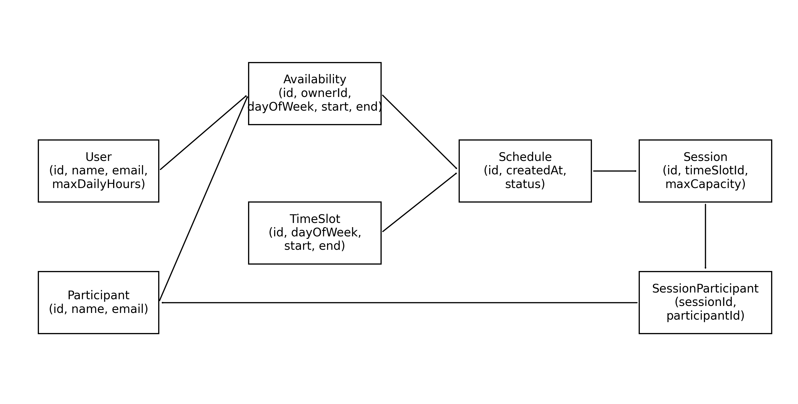

# O que foi realizado à data de:

* **14 março 2026**

### **Entidades principais**

— *User*: professor / utilizador principal

— *Participant*: alunos / participantes

— *Availability*: disponibilidades inseridas

— *TimeSlot*: blocos normalizados de 1h usados pelo algoritmo

— *Schedule*: horário criado pelo sistema

— *Session*: cada aula criada

— *SessionParticipant*: ligação alunos ↔ sessões (permite aulas de grupo)

### **Relações principais**

*User* → *Availability*
- o professor define disponibilidades

*Participant* → *Availability*
- cada aluno define disponibilidades

*Availability* → *TimeSlot*
- intervalos são convertidos em blocos discretizados

*Schedule* → *Session*
- um horário contém várias sessões

*Session* → *SessionParticipant* → *Participant*
- cada sessão pode ter até 5 alunos